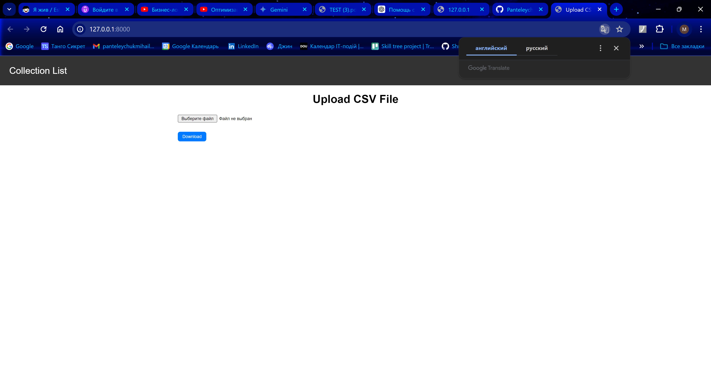
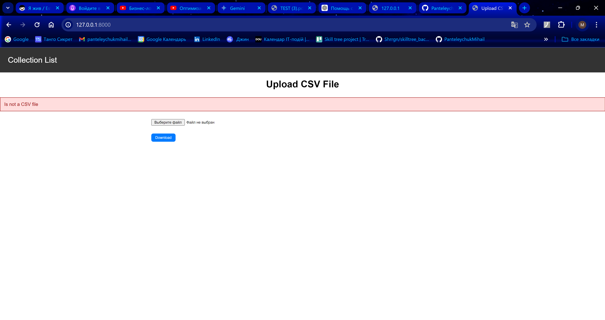
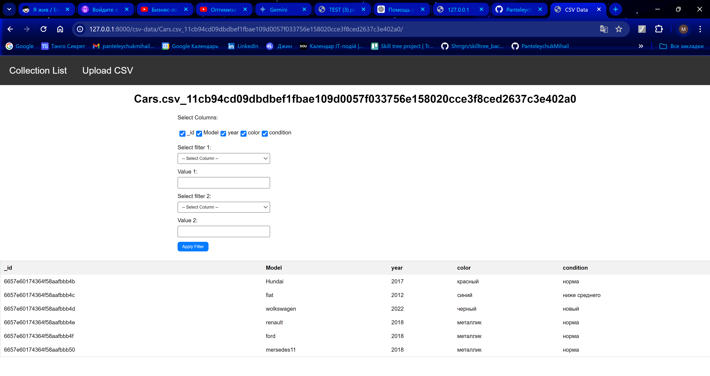
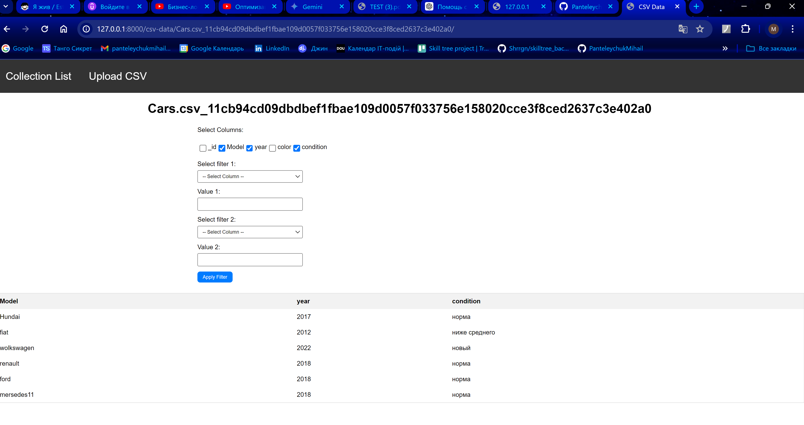
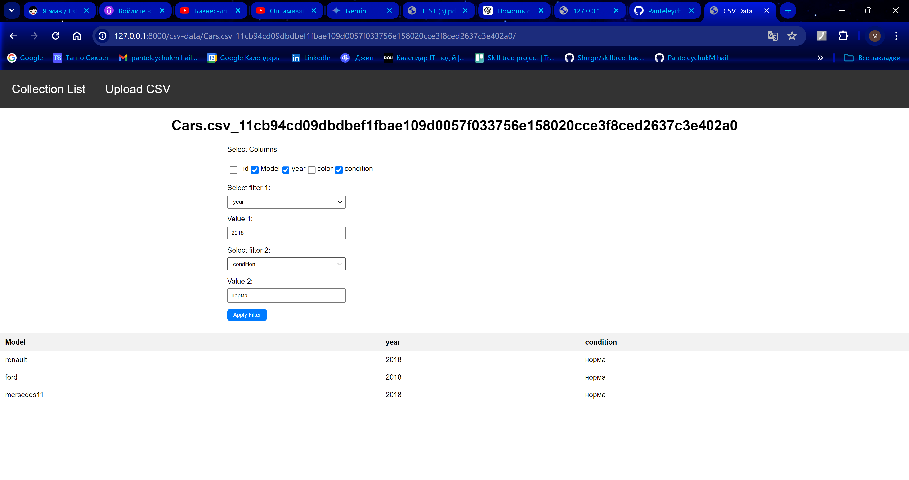
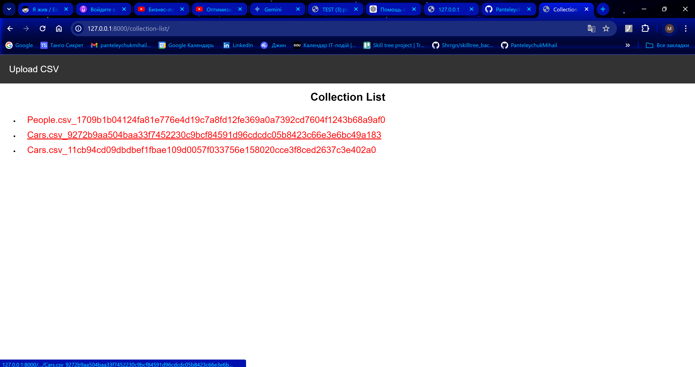

## CSV_VIEWER

#### csv_viewer is a service for reading csv_files and adding information to db.

## Project requires

- [Python 3.11](https://www.python.org/downloads/)
- [MongoDB]

## Installation

1. Clone the project
    ```bash
    https://github.com/PanteleychukMihail/csv_viewer.git
    ```

2. In the terminal choose the root directory of the project
 

3. Create and activate a virtual environment
   
    ```
    python -m venv myenv
    venv\Scripts\activate
    ```   
   
4. To install the required dependencies, run the following command:
    ```
   pip install -r requirements.txt   
   ```
5. Create and fill out the .env file according to the example, adding your values ​​for the variables 


## Running
#### Without Docker
```bash
python manage.py runserver      
```

## Tests

```bash
python3 -m pytest
```

## Screenshots 
1. 
2. 
3. 
4. 
5. 
6. 
   